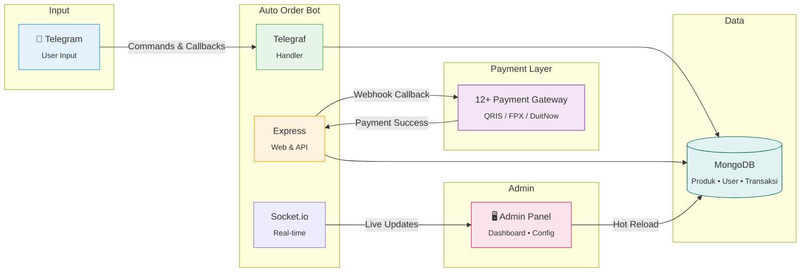
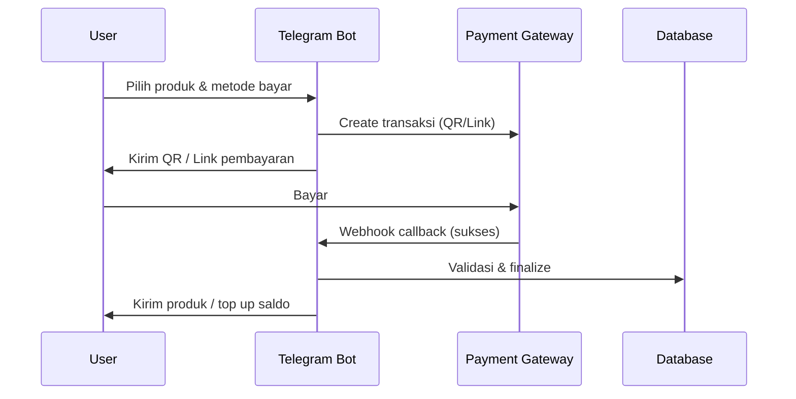

<div align="center">


[](https://nodejs.org/)
[](https://expressjs.com/)
[](https://telegraf.js.org/)
[](https://socket.io/)
[](https://mongodb.com/)
[](https://telegram.org/)
[](.)
[](.)
[](https://github.com/jundy779/Auto_Order_BOT)
[](https://github.com/jundy779/Auto_Order_BOT)

**🎯 Jualan Autopilot 24/7 • 💳 12+ Payment Gateway • 🌏 Indonesia & Malaysia • 🖥️ Admin Panel Modern**

[Demo Bot](https://t.me/FusionTempest_bot) • [Order Sekarang](#-order-sekarang) • [Hubungi Saya](#-hubungi-saya)


</div>

---

## 📑 Daftar Isi

| | |
|:---|:---|
| [🏗️ Arsitektur](#-arsitektur-bot-auto-order) | [💳 Payment Gateway](#-payment-gateway-supported) |
| [🆕 Terbaru](#-terbaru) | [🖥️ Admin Panel](#️-admin-panel-preview) |
| [🚀 Kenapa Pilih Bot Ini](#-kenapa-pilih-bot-ini) | [🎯 Cocok Untuk Jualan](#-cocok-untuk-jualan) |
| [✨ Fitur Premium](#-fitur-premium) | [📦 Fitur Lengkap](#-fitur-lengkap) |
| [⚖️ Perbandingan](#️-perbandingan) | [🛠️ Tech Stack](#️-tech-stack) |
| [❓ FAQ](#-faq) | [🛒 Paket Harga](#-paket-harga) |
| | [📞 Hubungi Saya](#-hubungi-saya) |

---

## 🆕 Terbaru

- **Panel Pterodactyl & gateway Malaysia** — Pembelian dan perpanjang panel memakai **urutan gateway yang sama** seperti checkout produk digital & top-up saldo (termasuk ToyyibPay, **Billplz**, CHIP, QRIS, dll. sesuai yang aktif di admin). Tombol metode bayar mengikuti prioritas `payment_gateway_order` / mode `BASE_CURRENCY=MYR`.
- **Billplz (Malaysia)** — FPX & e-wallet; callback `x_signature`; konfigurasi di admin & `.env.example` (`BILLPLZ_*`).
- **Orderkuota (Orkut API)** — QRIS dinamis Indonesia via mutasi (polling + `check_status`); logo/warna QR sama seperti gateway QRIS lain; lihat variabel `ORDERKUOTA_*` di `.env.example`
- **CHIP (DuitNow QR)** — Pembayaran Malaysia via DuitNow QR
- **ToyyibPay** — FPX & DuitNow untuk customer Malaysia
- **Dokumentasi lengkap** — Lihat `docs/CHIP_INTEGRATION_PLAN.md` untuk integrasi CHIP
- **12+ Payment Gateway** — Pilih sesuai kebutuhan bisnis kamu (ID & MY)

---

## 🏗️ Arsitektur Bot Auto Order



**✨ Key Features**

<table>
<tr>
<td align="center" width="33%">

**⚡ Performance**


Deteksi bayar &lt;3 detik
<br>Webhook real-time
<br>12+ gateway paralel

</td>
<td align="center" width="33%">

**🎯 Architecture**


Express + Telegraf
<br>Modular payment services
<br>Admin panel terintegrasi

</td>
<td align="center" width="33%">

**💾 Database**


MongoDB NoSQL
<br>Produk • User • Transaksi
<br>Hot reload tanpa restart

</td>
</tr>
</table>


## 🚀 Kenapa Pilih Bot Ini?

<table>
<tr>
<td>

### 😴 Tidur Pulas, Orderan Jalan

Bayangkan bangun tidur dan lihat saldo bertambah otomatis. Customer bayar QRIS → Produk terkirim **dalam 3 detik** tanpa kamu sentuh HP!

</td>
<td>

### 💰 Hemat Biaya Admin

Tidak perlu hire admin untuk handle orderan. Bot ini bekerja **24 jam non-stop** tanpa gajian, tanpa cuti, tanpa drama!

</td>
</tr>
<tr>
<td>

### 🌏 Multi-Region & Multi-Bahasa

Support pembayaran **Indonesia (QRIS)** dan **Malaysia** (ToyyibPay, Billplz, CHIP — FPX / DuitNow / e-wallet). Bot tersedia dalam 3 bahasa: Indonesia, English, Melayu.

</td>
<td>

### 🔄 Hot Reload Tanpa Restart

Ganti setting payment gateway, promo, atau konfigurasi lainnya **langsung dari admin panel** — tanpa perlu restart bot!

</td>
</tr>
</table>


## ⚖️ Perbandingan

<div align="center">

| | Bot Auto Order | Jualan Manual | Bot Lain (Umum) |
|:---|:---:|:---:|:---:|
| **Order 24/7** | ✅ | ❌ | ✅ |
| **Auto kirim produk** | ✅ <3 detik | ❌ | Varies |
| **12+ Payment Gateway** | ✅ ID + MY | ❌ | Terbatas |
| **Admin panel modern** | ✅ Real-time | ❌ | Sederhana |
| **Hot reload config** | ✅ Tanpa restart | - | Jarang |
| **Pterodactyl integration** | ✅ Full | ❌ | Jarang |
| **Multi-bahasa (ID/EN/MS)** | ✅ | ❌ | Terbatas |
| **Reseller API (H2H)** | ✅ | ❌ | Jarang |

</div>

---

## ✨ Fitur Premium

<div align="center">

| 🔥 Auto Payment | 🎁 Promo System | 🖥️ Admin Panel | 🔒 Super Secure |
|:---:|:---:|:---:|:---:|
| Deteksi bayar <3 detik | Flash Sale & Diskon | Real-time Dashboard | 2FA + Encryption |
| 12+ Payment Gateway | Voucher & Kupon | Push Notifications | CSRF Protection |
| ID + MY support | Timer countdown | Hot Reload Config | Security Logging |

</div>

### ⚡ Yang Bikin Beda dari Bot Lain:

- ✅ **12+ Payment Gateway** — Pakasir, Qiospay, Sanpay, Midtrans, Tripay, Violetpay, iPaymu, GoPay Merchant, Orderkuota (ID); **ToyyibPay**, **Billplz** (FPX / e-wallet), **CHIP** (DuitNow QR) untuk Malaysia
- ✅ **Promo Spesial / Flash Sale** - Bikin urgency dengan countdown timer
- ✅ **Logo di QRIS** - Branding profesional di setiap pembayaran
- ✅ **Pterodactyl Integration** - Jualan hosting panel full otomatis + auto delete expired
- ✅ **Hot Reload Config** - Ganti setting dari admin panel tanpa restart bot
- ✅ **Anti Duplicate Payment** - Sistem cerdas cegah pembayaran ganda (Mutation ID Tracking)
- ✅ **Multi-bahasa** - Indonesia, English, Melayu
- ✅ **Reseller API (H2H)** - Jadi supplier, buka reseller dengan API terintegrasi
- ✅ **Exchange Rate** - Otomatis convert harga untuk user internasional
- ✅ **Responsive Admin** - Kelola dari HP juga bisa!

**📊 Alur Order → Pembayaran → Pengiriman**




## 💳 Payment Gateway Supported

<div align="center">

| Gateway | Region | Tipe | Auto Detect | Logo/QR |
|:---:|:---:|:---:|:---:|:---:|
| **Pakasir** | 🇮🇩 Indonesia | QRIS | ✅ 3 detik | ✅ |
| **Qiospay** | 🇮🇩 Indonesia | QRIS Dynamic | ✅ 3 detik | ✅ |
| **Sanpay** | 🇮🇩 Indonesia | QRIS | ✅ 3 detik | ✅ |
| **Midtrans** | 🇮🇩 Indonesia | QRIS | ✅ 3 detik | ✅ |
| **Tripay** | 🇮🇩 Indonesia | QRIS | ✅ 5 detik | ✅ |
| **Violetpay** | 🇮🇩 Indonesia | QRIS | ✅ Auto | ✅ |
| **iPaymu** | 🇮🇩 Indonesia | QRIS (Redirect) | ✅ Callback | ✅ |
| **ToyyibPay** | 🇲🇾 Malaysia | FPX / DuitNow | ✅ Auto Detect | - |
| **Billplz** | 🇲🇾 Malaysia | FPX / e-wallet | ✅ Callback (`x_signature`) | - |
| **CHIP** | 🇲🇾 Malaysia | DuitNow QR | ✅ Callback | - |
| **GOPAY MERCHANT** | 🇮🇩 Indonesia | QRIS (Mutation) | ✅ Auto Detect | ✅ |
| **Orderkuota** | 🇮🇩 Indonesia | QRIS Dynamic (mutasi) | ✅ Polling + cek status | ✅ |

> 💡 **Pro Tip:** Bisa aktifkan beberapa gateway sekaligus! Customer bebas pilih mau bayar lewat mana.  
> 🌏 **Malaysia Support:** ToyyibPay (FPX / DuitNow), Billplz (FPX / e-wallet), CHIP (DuitNow QR) — sama tersedia untuk **produk digital**, **top-up saldo**, dan **beli / perpanjang panel Pterodactyl** (sesuai gateway yang diaktifkan).

</div>

---

## 🖥️ Admin Panel Preview

<div align="center">

```
┌─────────────────────────────────────────────────────────────┐
│  📊 DASHBOARD                                               │
├─────────────────────────────────────────────────────────────┤
│                                                             │
│   💰 Pendapatan Hari Ini     📦 Transaksi      👥 Users    │
│   ┌─────────────────┐       ┌─────────┐      ┌─────────┐   │
│   │   Rp 2.450.000  │       │   145   │      │   892   │   │
│   │     ↑ 23%       │       │  ↑ 12%  │      │  ↑ 5%   │   │
│   └─────────────────┘       └─────────┘      └─────────┘   │
│                                                             │
│   📈 Grafik Penjualan 7 Hari Terakhir                      │
│   ═══════════════════════════════════                      │
│        ▄▄      ▄▄                                          │
│     ▄▄ ██ ▄▄  ██ ▄▄                                        │
│   ▄▄██ ██ ██ ▄██ ██ ▄▄                                     │
│   ████ ██ ██ ███ ██ ██ ▄▄                                  │
│   ────────────────────────                                 │
│   Sen Sel Rab Kam Jum Sab Min                              │
│                                                             │
└─────────────────────────────────────────────────────────────┘
```

**Fitur Admin Panel:**
- 📊 Dashboard statistik real-time
- 📦 Kelola produk, kategori, stok
- 💳 Payment gateway management (12+ gateway, hot reload)
- 🎫 Voucher management
- 🖥️ Panel package management (Pterodactyl)
- 📢 Broadcast ke semua user (filter, media)
- 🔔 Push notification ke browser
- 🔒 Security: 2FA, audit log, CSRF
- 📱 Responsive - bisa dari HP!

</div>

---

## 📱 Bot Interface

<div align="center">

```
┌──────────────────────────────────┐
│  🤖 AUTO ORDER BOT               │
│  ════════════════════════════    │
│                                  │
│  Selamat datang, Jundy! 👋       │
│                                  │
│  ┌────────────────────────────┐  │
│  │  🎁 PROMO SPESIAL          │  │
│  └────────────────────────────┘  │
│                                  │
│  ┌──────────┐ ┌──────────────┐   │
│  │🛍️ Produk │ │💰 Cek Saldo  │  │
│  └──────────┘ └──────────────┘   │
│  ┌──────────┐ ┌──────────────┐   │
│  │📜 Riwayat│ │🖥️ Beli Panel │  │
│  └──────────┘ └──────────────┘   │
│  ┌──────────┐ ┌──────────────┐   │
│  │📱 PPOB   │ │⚙️ Pengaturan │  │
│  └──────────┘ └──────────────┘   │
│                                  │
│  🌐 ID | EN | MS                 │
│                                  │
└──────────────────────────────────┘
```

</div>

---

## 🎯 Cocok Untuk Jualan:

<div align="center">

| 🎮 Akun Premium | 📱 Pulsa & Kuota | 🖥️ Panel Hosting | 🎫 Voucher & License |
|:---:|:---:|:---:|:---:|
| Netflix | All Operator | Pterodactyl | Game |
| Spotify | Paket Data | VPS | Streaming |
| VPN | Token Listrik | Shared Host | Software |
| Game | E-Wallet | Dedicated | License Key |

</div>

---

## 📦 Fitur Lengkap

<details>
<summary><b>🛍️ Manajemen Produk</b></summary>

- Unlimited produk & kategori
- Bulk upload stok via file/teks
- Auto expired stock
- Sistem garansi fleksibel (7 hari - Full garansi)
- Stok otomatis berkurang setelah pembelian
- Required fields untuk produk custom (email, username, dll)
- Pagination produk per kategori
- Best seller produk
- Critical stock alert
- Retrieve stock (download sisa stok)

</details>

<details>
<summary><b>🎁 Promo & Voucher</b></summary>

- **Flash Sale / Promo Spesial** dengan countdown timer
- Voucher diskon (persentase atau nominal)
- Voucher redeem saldo / produk
- Maximum discount control
- Batas penggunaan per user
- Tanggal expired otomatis
- Analytics penggunaan voucher
- Channel notifications untuk promo

</details>

<details>
<summary><b>🖥️ Pterodactyl Integration</b></summary>

- Jualan panel hosting langsung dari bot
- Auto create user di Pterodactyl
- Auto create server dengan spec sesuai paket
- **Auto delete server expired** + notifikasi
- Warning H-3 dan H-1 sebelum expired
- Kelola paket panel dari admin web
- **Metode pembayaran panel** mengikuti gateway yang sama dengan checkout lain (QRIS Indonesia, ToyyibPay / Billplz / CHIP untuk Malaysia, dll.) — bukan hanya satu atau dua gateway tetap

</details>

<details>
<summary><b>💳 Payment System</b></summary>

- **12+ payment gateway** terintegrasi
- **Indonesia (QRIS):** Pakasir, Qiospay, Sanpay, Midtrans, Tripay, Violetpay, iPaymu, GoPay Merchant, Orderkuota
- **Malaysia:** ToyyibPay (FPX / DuitNow), **Billplz** (FPX / e-wallet), CHIP (DuitNow QR)
- Auto detect pembayaran < 3 detik
- **Anti duplicate payment** (Sistem Mutation ID tracking)
- Hot reload config (ganti setting tanpa restart)
- Custom logo di QRIS
- QRIS fee otomatis (configurable)
- Webhook callback dengan validasi signature
- Saldo internal + top up via QRIS

</details>

<details>
<summary><b>🌐 Multi-Language & Multi-Region</b></summary>

- **3 Bahasa:** Indonesia, English, Bahasa Melayu
- **Indonesia:** Semua QRIS gateway (Pakasir, Qiospay, Sanpay, Midtrans, Tripay, Violetpay, iPaymu, GoPay Merchant, Orderkuota)
- **Malaysia:** ToyyibPay, Billplz, CHIP (urutan & aktif/nonaktif lewat admin; mode `MYR` memfilter ke gateway Malaysia)
- Exchange rate support untuk user internasional
- Keyboard & pesan otomatis sesuai bahasa user

</details>

<details>
<summary><b>🔗 Reseller API (H2H)</b></summary>

- RESTful API untuk reseller
- Endpoint: order, cek status, cek saldo, list produk
- API key authentication
- Rate limiting per reseller
- Dokumentasi API lengkap
- Cocok untuk supplier yang buka reseller

</details>

<details>
<summary><b>🔒 Security</b></summary>

- Two-Factor Authentication (2FA)
- TOTP (Google Authenticator) + Telegram OTP
- CSRF Protection
- Rate Limiting
- Security logging & audit trail
- Encrypted sensitive data
- IP Whitelist untuk callback
- Admin audit log

</details>

<details>
<summary><b>📊 Analytics & Report</b></summary>

- Dashboard statistik real-time
- Grafik penjualan
- Top produk terlaris
- User paling aktif (today & all-time)
- Revenue harian/mingguan/bulanan
- Export data transaksi
- Push notification ke browser

</details>

<details>
<summary><b>📄 Invoice & Notifikasi</b></summary>

- Invoice generation (Canvas)
- Custom logo & banner invoice
- Large product delivery (.txt)
- Channel notifications (pembelian, top-up, voucher)
- Invoice image ke channel
- Custom sticker/GIF notifikasi
- Custom welcome sticker /start
- Custom gambar /start

</details>

<details>
<summary><b>⚙️ Fitur Tambahan</b></summary>

- Full garansi langganan
- Manual confirmation transaksi
- Order admin tanpa pay
- Support ticket system
- Ban/unban user + banned list
- Broadcast message (filter, media support)
- Cancel transaksi oleh user
- Cek status transaksi real-time

</details>

---

## 🛠️ Tech Stack

<div align="center">


</div>

---

## 📋 Requirements

| Kebutuhan | Keterangan | Biaya |
|:---|:---|:---:|
| VPS / Panel | Minimal 2GB RAM, Node.js 21+ | ~50rb/bulan (OPSIONAL)|
| MongoDB | MongoDB Atlas (cloud) | **GRATIS** |
| Bot Token | Dari @BotFather Telegram | **GRATIS** |
| Payment Gateway | Pilih salah satu atau lebih | Varies |

---

## ❓ FAQ

<details>
<summary><b>Apakah harus punya VPS?</b></summary>

Ya, bot perlu jalan 24/7. Minimal VPS 1GB RAM (~50rb/bulan) atau panel hosting yang support Node.js. Bisa juga pakai Railway, Render, atau VPS gratis (dengan batasan).
</details>

<details>
<summary><b>Bisa pakai hosting shared?</b></summary>

Tergantung. Hosting shared biasanya tidak allow long-running process. Lebih cocok pakai VPS, cloud (MongoDB Atlas gratis), atau panel yang support Node.js.
</details>

<details>
<summary><b>Bagaimana cara ganti payment gateway?</b></summary>

Lewat Admin Panel → Payment Gateway. Isi API key & config, lalu aktifkan. Bisa aktifkan beberapa gateway sekaligus — customer pilih sendiri. **Hot reload** = tidak perlu restart bot.
</details>

<details>
<summary><b>Support Pterodactyl versi berapa?</b></summary>

Kompatibel dengan Pterodactyl Panel 1.x. Untuk setup detail, lihat `docs/ARCHITECTURE.md` atau dokumentasi instalasi.
</details>

<details>
<summary><b>Apakah bisa jualan tanpa Pterodactyl?</b></summary>

Bisa! Pterodactyl hanya untuk yang jual hosting/panel. Untuk produk digital (akun, voucher, license key), tidak perlu Pterodactyl.
</details>

<details>
<summary><b>Customer Malaysia bisa bayar?</b></summary>

Ya! Untuk Malaysia: ToyyibPay (FPX / DuitNow), Billplz (FPX / e-wallet), dan CHIP (DuitNow QR) — bisa dipakai untuk checkout produk, top-up saldo, dan panel Pterodactyl (yang diaktifkan). Bot juga support multi-bahasa (Melayu).
</details>

---

## 🧭 Dokumentasi Teknis (Developer)

Dokumen ini membantu kamu (atau tim) memahami alur logic, struktur, API, dan data model untuk maintenance/refactor ke depan:

- `docs/PRD.md` — Product Requirement Documentation (source-of-truth requirement)
- `docs/ARCHITECTURE.md` — arsitektur & alur order → payment → finalize → delivery
- `docs/API.md` — ringkasan endpoint HTTP (public/admin/H2H/webhook)
- `docs/DATA_MODEL.md` — ringkasan skema MongoDB (Mongoose)
- `docs/RUNBOOK.md` — setup/run & troubleshooting operasional
- `docs/REFACTOR_ROADMAP.md` — rencana refactor bertahap (tanpa ubah behavior)
- `docs/PAYMENT_DESIGN.md` — arsitektur payment gateway
- `docs/CHIP_INTEGRATION_PLAN.md` — rencana integrasi CHIP (DuitNow QR Malaysia)
- `docs/PAYMENT_CALLBACK_URL.md` — URL callback webhook (termasuk Billplz & gateway lain)
- `docs/ROLE_BASED_ACCESS_PLAN.md` — rencana RBAC admin panel (role, menu, owner dari env/Gmail)
- `docs/ANTI-SPAM-CONFIG.md` — rate limit & anti-spam bot (`kill-port.bat` / `restart-bot.bat`)
- `docs/MENGURANGI-BARIS-BOT-JS.md` — panduan modularisasi `bot.js`
- `docs/MULTI-PLATFORM-PLAN.md` — rencana multi-platform
- `CHANGELOG.md` — riwayat perubahan per versi

## ▶️ Cara Menjalankan (Developer)

1. Salin `.env.example` → `.env`, lalu isi nilai sensitif (lihat juga `docs/RUNBOOK.md`). Payment umum: `BASE_CURRENCY`, `CURRENCY_LOCALE`, `SHOW_IDR_ESTIMATE`; Orderkuota: variabel `ORDERKUOTA_*`.
2. Install dependency:

```bash
npm install
```

3. Jalankan bot:

```bash
npm run start
```

## 🔐 Catatan Keamanan

- Jangan pernah membagikan atau meng-commit `.env` (bot token, API key, private key, password).
- Endpoint webhook harus selalu memverifikasi signature (untuk provider yang mendukung).
- Jika menambah fitur payment/delivery baru, pastikan flow finalisasi tetap **idempotent** (anti dobel-kirim/dobel-success).

<div align="center">

# 💎 ORDER SEKARANG

### Pilih Paket yang Cocok Buat Kamu

</div>

---

## 🛒 Paket Harga

<div align="center">

| | 🚀 INSTALASI | 🔄 PERPANJANGAN | 💎 BELI SC | ⚡ CUSTOM |
|:---|:---:|:---:|:---:|:---:|
| **Harga** | **Rp 40.000** | **Rp 25.000**/bulan | **Rp 675.000** | Nego |
| Keterangan | Bulan pertama | Bulan ke-2 dst | Lifetime | Request |
| Source Code | ❌ | ❌ | ✅ Full akses | ✅ |
| Free Update | ✅ | ✅ | ❌ | ❌ |
| Support | ✅ Full | ✅ Full | ✅ Full | ✅ Priority |
| Custom Fitur | ❌ | ❌ | 1x Gratis | Unlimited |

> 💡 **Instalasi Rp 40.000** sudah termasuk setup lengkap + 1 bulan pertama!  
> 🔄 **Perpanjangan hanya Rp 25.000/bulan** - Lebih hemat!

</div>

### ✅ Semua Paket Dapat:

- ✓ Bot fully functional & tested
- ✓ Admin panel lengkap (responsive)
- ✓ 12+ payment gateway siap pakai
- ✓ Multi-bahasa (ID/EN/MS)
- ✓ Panduan instalasi detail
- ✓ Bantuan setup awal
- ✓ Support via Telegram
- ✓ Akses grup diskusi

### 🎁 Bonus Pembelian:

- 🔥 Template produk siap pakai
- 📚 Video tutorial instalasi
- 💡 Tips & trick jualan online
- 🤝 Konsultasi bisnis digital

---

## 📞 Hubungi Saya

<div align="center">

[](https://t.me/TempestVPNOfficial)
[](https://wa.me/6283111380628)

**⏰ Fast Response: 09:00 - 22:00 WIB**

---

### 🌟 Testimoni

> *"Bot nya keren, pembayaran langsung kedeteksi. Jualan jadi autopilot!"*  
> — **@user1** ⭐⭐⭐⭐⭐

> *"Admin panelnya lengkap banget, gampang dipake."*  
> — **@user2** ⭐⭐⭐⭐⭐

> *"Support nya fast respon, recommended!"*  
> — **@user3** ⭐⭐⭐⭐⭐

---

### 📈 Statistik

| 👥 User Terdaftar | 📦 Transaksi Diproses | ⭐ Rating | 💳 Gateway |
|:---:|:---:|:---:|:---:|
| **500+** | **10.000+** | **4.9/5** | **12+** |

---

[](https://t.me/TempestVPNOfficial)

**💬 Chat langsung untuk konsultasi GRATIS!**


<div align="center">


<sub>Made with ❤️ by **FusionTempest** • v7.5.0 • © 2024-2026</sub>

</div>
