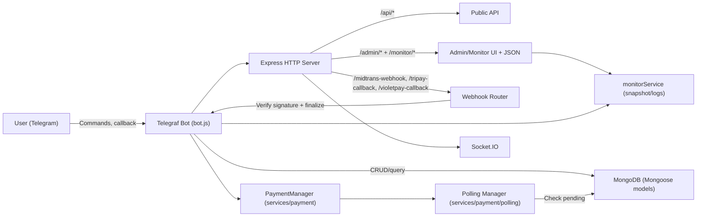

# Arsitektur & Alur Logic

## Komponen utama

- **Telegram Bot (Telegraf)**: menerima command/callback, memandu user memilih produk, membuat transaksi, dan mengirim hasil delivery.
- **HTTP Server (Express)**:
  - **Public API** (`/api/*`): web store + checkout + status order.
  - **Admin/Monitor** (`/admin/*`, `/monitor/*`): UI dan JSON endpoints untuk operasi & observability.
  - **Webhook endpoints**: menerima callback gateway tertentu (dipasang lewat router webhook).
- **Realtime (Socket.IO)**: broadcast statistik/dashboard (terpasang di server HTTP yang sama).
- **Database (MongoDB via Mongoose)**: menyimpan user, produk, transaksi, setting, admin, reseller, dll.
- **Payment layer**:
  - `services/payment/index.js` sebagai **PaymentManager** (adapter gateway per provider).
  - `services/payment/polling.js` menjalankan polling berkala untuk transaksi pending.
  - `routes/webhooks.js` untuk webhook provider tertentu (signature check → finalize).
- **Monitoring layer**: `monitor/monitorService.js` untuk snapshot sistem, ring buffer log, dan status payment/bot.
- **Integrasi eksternal** (opsional): Pterodactyl panel provisioning (feature).

> Catatan: detail lengkap mengenai **state machine Telegram** (bagaimana `userStates` dan `adminStates` mengatur langkah user/admin) ada di [`docs/STATE_MACHINE.md`](./STATE_MACHINE.md).

## Diagram arsitektur (high level)

## Alur transaksi end-to-end

### 1) Checkout (membuat transaksi PENDING)

1. User memilih produk dan kuantitas.
2. Sistem menghitung total (termasuk fee/diskon bila ada).
3. Sistem membuat dokumen `Transaction` dengan status `PENDING` + metadata payment:
   - `paymentProvider`, `paymentMethod`, `paymentCountry`, `currency`
   - `externalPayAmount` (jika ada)
   - `waktuExpired` (jika ada)
4. Sistem mengembalikan QR / pay URL / instruksi pembayaran ke user.

### 2) Verifikasi pembayaran

Ada 2 jalur utama yang sama-sama bermuara ke `finalizeTransaction`:

- **Polling** (utama untuk gateway yang mendukung mutasi/status check tanpa webhook):
  - Modul polling mengambil transaksi `PENDING` terbaru per provider (dibatasi `limit` dan time window).
  - Menggunakan mutex flag (`isProcessingX`) untuk mencegah overlap.
  - Matching dilakukan berdasarkan reference/amount/time window (contoh: Qiospay & Sanpay via mutasi).
  - Untuk mencegah double-claim mutasi, transaksi menyimpan `gatewayTransactionId` dan dicek ke DB.

- **Webhook** (untuk gateway tertentu):
  - Endpoint webhook memverifikasi signature terlebih dahulu.
  - Validasi amount vs transaksi.
  - Jika valid dan status “paid”, sistem memanggil `finalizeTransaction`.

### 3) Finalisasi & delivery

Saat finalize sukses:

- Transaksi diubah ke `SUCCESS`, set `waktuBayar`, dan simpan referensi gateway bila ada.
- Sistem menghapus pesan QR payment (bila tersimpan `paymentMessageId`/`paymentMessageChatId`).
- Delivery:
  - Produk `AUTO`: ambil item dari `Product.kontenProduk` sesuai kuantitas lalu kirim ke user.
  - Produk `MANUAL`: set `produkInfo.isManualOrder=true` + `manualProcessStatus=WAITING` → muncul di Admin Panel.

## Konsistensi & idempotency (aturan penting)

- **Satu transaksi hanya boleh finalized sekali**.
- Untuk provider berbasis mutasi, gunakan `gatewayTransactionId` sebagai “claim key” agar 1 mutasi tidak dipakai oleh 2 transaksi.
- Webhook harus menolak signature tidak valid (jangan “best effort”).

## Observability

- `monitorService` merekam:
  - ring buffer log (info/warn/error)
  - snapshot sistem (CPU/RAM/disk/network), bot status, dan statistik transaksi
  - status payment gateway (enabled/lastError)

