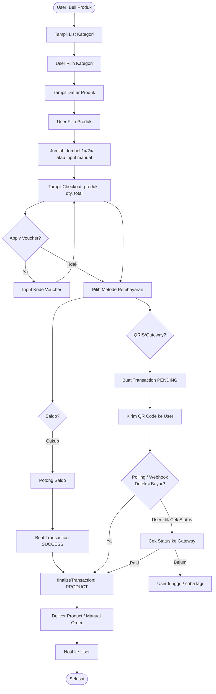
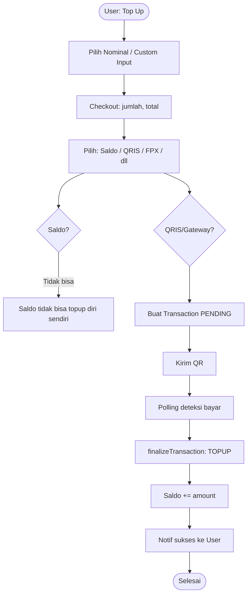
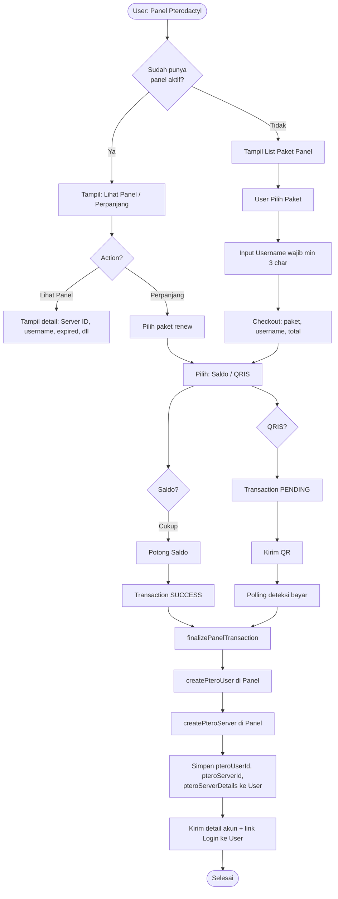
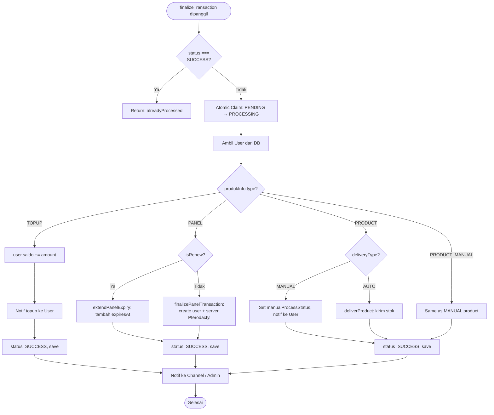
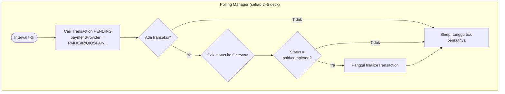
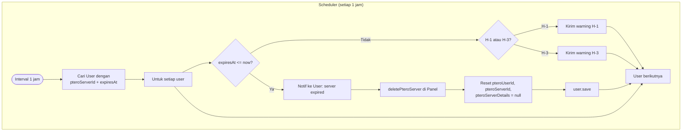
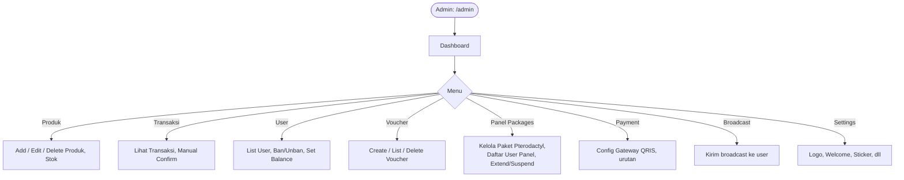
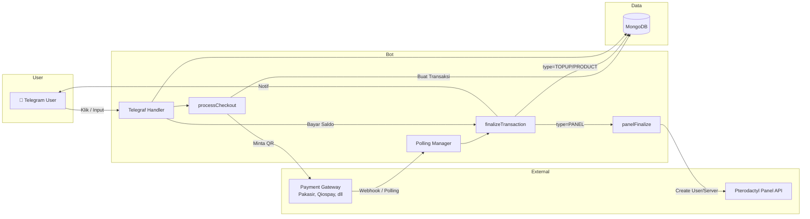

# 📊 Flowchart Auto Order Bot

Dokumen ini berisi flowchart lengkap alur kerja Bot Auto Order. Diagram menggunakan Mermaid dan dapat dirender di GitHub, VS Code, Cursor, dan viewer Markdown lainnya.

---

## 1. Main Menu & Entry Points

```
┌─────────────────────────────────────────────────────────────────────┐
│                        USER BUKA BOT                                 │
└─────────────────────────────────────────────────────────────────────┘
                                    │
                                    ▼
┌─────────────────────────────────────────────────────────────────────┐
│                        MAIN KEYBOARD                                 │
├─────────────────────────────────────────────────────────────────────┤
│  📂 Beli Produk  │  💰 Top Up  │  🖥️ Panel Pterodactyl (jika aktif) │
│  🎫 Redeem Voucher │  📦 Stock Report │  🔥 Best Seller              │
│  💡 How to Order │  🧑‍💼 Support │  📦 Reseller API                   │
│  📂 Account Info │  🧮 Refund Calculator │  👑 Admin (jika admin)    │
└─────────────────────────────────────────────────────────────────────┘
```

---

## 2. Flowchart: Beli Produk (Product Purchase)



---

## 3. Flowchart: Top Up Saldo



---

## 4. Flowchart: Beli Panel Pterodactyl



---

## 5. Flowchart: Finalize Transaction (Inti Logic)



---

## 6. Flowchart: Payment Polling (Deteksi Bayar Otomatis)



---

## 7. Flowchart: Pterodactyl Expiry Scheduler



---

## 8. Flowchart: Admin Panel (Ringkas)



---

## 9. Diagram Ringkas: Arus Data



---

## 10. Tabel Ringkasan Trigger → Action

| Trigger User | Handler | Output |
|--------------|---------|--------|
| 📂 Beli Produk | `flowProducts` | List kategori → produk → checkout |
| 💰 Top Up | `flowTopup` | Nominal → checkout → QR/saldo |
| 🖥️ Panel Pterodactyl | `bot.hears` + `panel_select` | Paket → username → checkout |
| Bayar pakai Saldo | `handlePanelPayment` / `processCheckout` | Langsung finalize |
| Bayar pakai QRIS | `processCheckout` | Transaction PENDING + kirim QR |
| Polling deteksi bayar | `polling.js` | `finalizeTransaction` |
| Klik Cek Status | `check_status` action | `handlePaymentStatusCheck` → finalize |
| Webhook gateway | Route `/pakasir-callback`, dll | `finalizeTransaction` |

---

*Dokumen ini menggambarkan arsitektur Bot Auto Order v6.5.0. Untuk detail implementasi, lihat kode di `bot.js`, `features/`, `services/`.*
